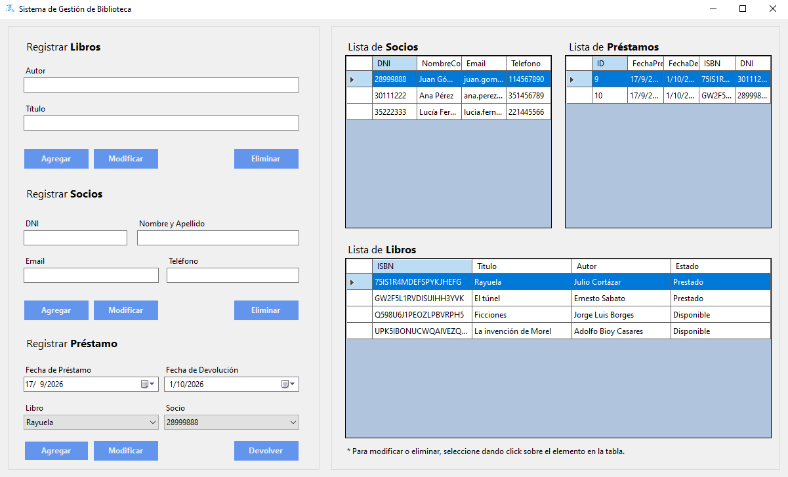

*[Leer en español](README.md)*

# Library Management System

A C# desktop application built with Windows Forms for running a library: the
book catalog, the members, and the loans. Data is stored in SQL Server through
Entity Framework Core, using the Code-First approach.

The solution is split into four projects, one per layer:

* **Vista** (view): the form. It validates the input and asks the controller for everything.
* **Controladora** (controller): the business rules, such as a book on loan not
  being lendable again, or the return date having to come after the loan date.
* **Modelo** (model): the Entity Framework context, the migration, and one
  repository per entity.
* **Entidades** (entities): the Libro, Socio, and Prestamo classes.

The application keeps track of each book's status. It becomes "Prestado" (on
loan) when a loan is registered, and goes back to "Disponible" (available) when
it's returned, when the loan is switched to another book, or when the member who
had it is deleted.

## Screenshots

**Books, members, and loans loaded, with two books on loan**



## Prerequisites

To open and run this project in your local environment, you need the following installed:

* .NET 8 SDK
* Visual Studio 2022
* SQL Server (Express or Developer Edition)

## Database Setup

The database is named `SistemaGestionBibliotecaDB` and is created from the
migration included in the Modelo project. The connection string uses Windows
Authentication (`Integrated Security=True`).

1. Clone or download this repository to your computer.
2. Open the `Sistema de Gestion de Biblioteca.sln` file in Visual Studio.
3. If your server isn't named `.\SQLEXPRESS`, open the `Context` class in the
   **Modelo** project and change the `Data Source` in the connection string.
4. Set **Vista** as the startup project.
5. Open the **Package Manager Console**, select **Modelo** as the default
   project, and run:
   ```powershell
   Update-Database
   ```
6. Press **Start** (or F5) to build and run the application.

---

## Author

**Leonel Maximiliano Blumberg**<br>
Software Developer | .NET · C# · ASP.NET · SQL | Systems Engineering Student

[LinkedIn](https://www.linkedin.com/in/leonel-blumberg) · [GitHub](https://github.com/Leonel-Blumberg) · [Email](mailto:leonelblumberg.it@gmail.com)
