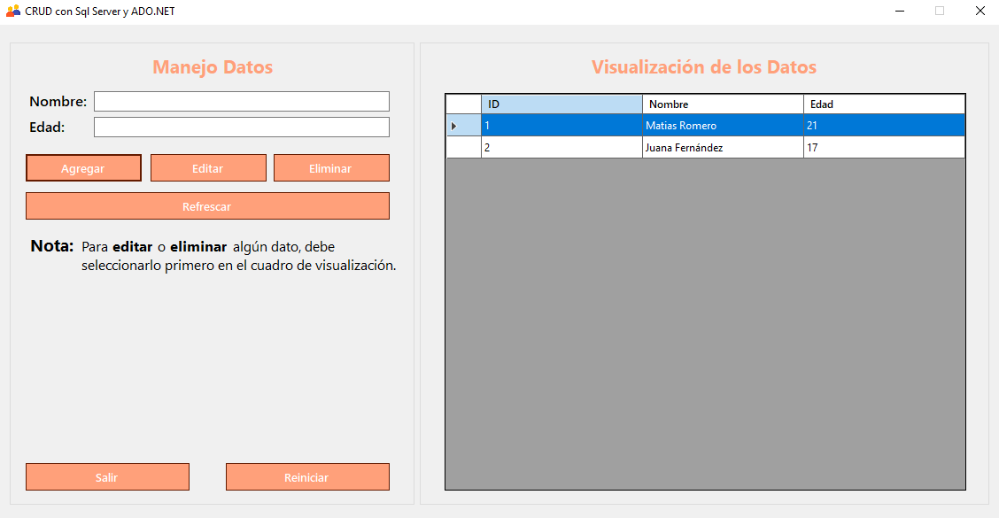
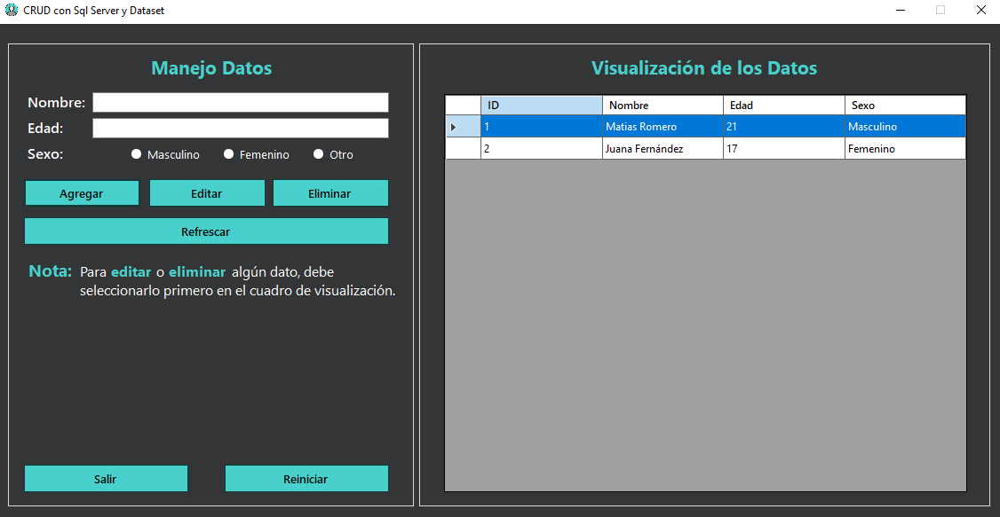
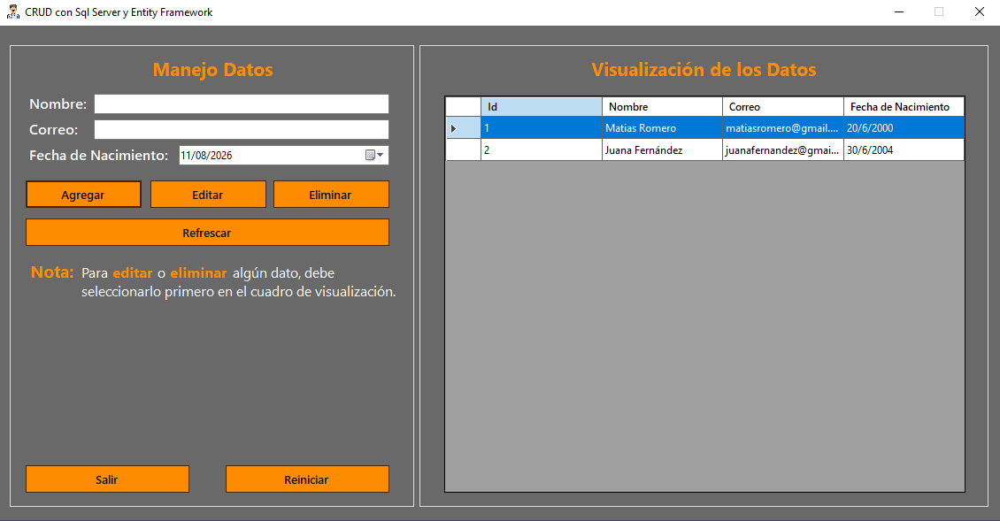

*[Read this in English](README.en.md)*

# CRUDs con SQL Server: ADO.NET, DataSet y Entity Framework

Aplicación de escritorio en C# (Windows Forms) para gestionar registros de
personas sobre SQL Server: alta, edición, eliminación y consulta.

El punto del repositorio no es el CRUD en sí, sino **resolver el mismo acceso a
datos de tres formas distintas** en .NET: ADO.NET puro, DataSet tipado y Entity
Framework (Database-First). Los tres comparten interfaz y lógica; lo único que
cambia es la capa de persistencia.

## Capturas

**CRUD con ADO.NET**

**CRUD con DataSet**

**CRUD con Entity Framework**

## Requisitos Previos
Para ejecutar estos proyectos en tu entorno local, necesitas tener instalado:
* .NET 8 SDK
* Visual Studio 2022
* SQL Server (Express o Developer)
* SQL Server Management Studio (SSMS) o similar para ejecutar scripts (**OPCIONAL**).

## Configuración de la Base de Datos y Ejecución
Debido a que estos proyectos utilizan ADO.NET y enfoques Database-First, la base de datos correspondiente y sus tablas deben crearse manualmente antes de correr el programa.

**Pasos generales para ejecutar por primera vez:**

1. Clona este repositorio en tu máquina local.
2. Abre SQL Server Management Studio (SSMS) y conéctate a tu servidor local (`.\SQLEXPRESS`).
3. Ejecuta los scripts SQL proporcionados para crear la base de datos y las tablas específicas requeridas por cada proyecto (recuerda que cada proyecto usa una tabla distinta).
4. Abre la solución (`.sln`) en Visual Studio.

**Configuración específica según el proyecto que desees probar:**

* **CRUD Sql Server y ADO.NET:**
    * Este proyecto utiliza ADO.NET puro. Si tu servidor se llama `.\SQLEXPRESS`, ya está configurado. Solo debes establecerlo como **Proyecto de inicio**.

* **CRUD Sql Server y Dataset:**
    * Si tu servidor se llama `.\SQLEXPRESS`, ya está configurado.
    * Si no es el caso, ve al Explorador de soluciones, abre el archivo `DatosDS.xsd`, ve a las propiedades de **"Personas2TableAdapter"** y modifica la **ConnectionString** en **Connection** para que coincida con el nombre de tu servidor local de SQL Server.

* **CRUD Sql Server y Entity Framework:**
    * Este proyecto utiliza Entity Framework con el enfoque Database-First.
    * Si tu servidor se llama `.\SQLEXPRESS`, ya está configurado.
    * Si no es el caso, abre la carpeta **`Models`**, abre la clase **"CRUDconEntityFramework"** y actualiza el `Server` en la cadena de conexión para que coincida con tu servidor local.

Una vez configurado el proyecto elegido, asegúrate de que esté seleccionado como proyecto de inicio, compila y ejecuta la solución.

---

## Autor

**Leonel Maximiliano Blumberg** 
Desarrollador de Software | .NET · C# · ASP.NET · SQL | Estudiante de Ing. en Sistemas

[LinkedIn](https://www.linkedin.com/in/leonel-blumberg) · [GitHub](https://github.com/Leonel-Blumberg) · [Email](mailto:leonelblumberg.it@gmail.com)
