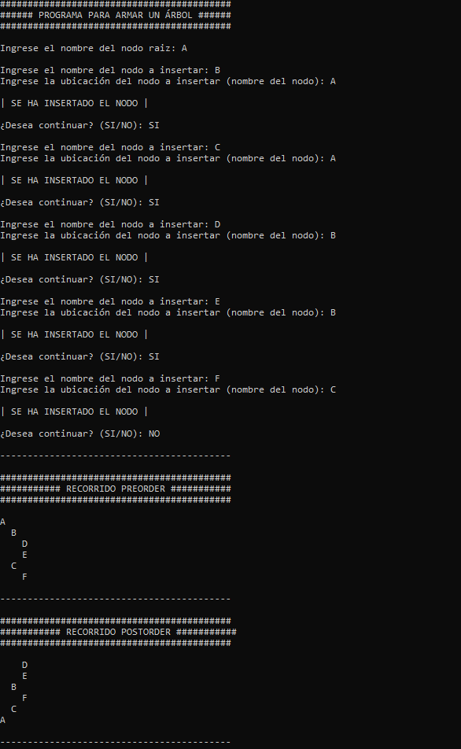

*[Leer en español](README.md)*

# Tree Exercise

A C# console application that builds an n-ary tree interactively: you enter
the root node and then each node, specifying which parent it goes under.

The structure uses the **child-sibling** representation, where each node holds
a reference to its first child and another to its next sibling. This allows a
node to have any number of children without using lists or arrays. Parent
lookup and both preorder and postorder traversals are implemented recursively,
with per-level indentation to visualize the hierarchy in the console.

## Screenshot

## Prerequisites

To open and run this project in your local environment, you need the following installed:

* .NET Framework 4.8
* Visual Studio 2022

## How to run the project

1. Clone or download this repository to your computer.
2. Open the `Ejercicio Arbol.sln` file in Visual Studio.
3. Press **Start** (or F5) to build and run the application.

---

## Author

**Leonel Maximiliano Blumberg**
Software Developer | .NET · C# · ASP.NET · SQL | Systems Engineering Student

[LinkedIn](https://www.linkedin.com/in/leonel-blumberg) · [GitHub](https://github.com/Leonel-Blumberg) · [Email](mailto:leonelblumberg.it@gmail.com)