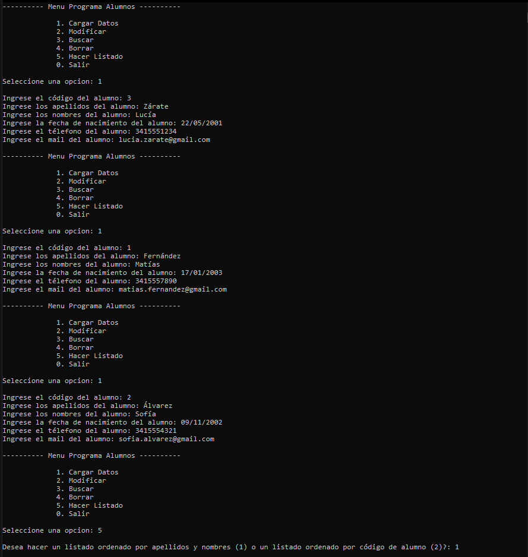
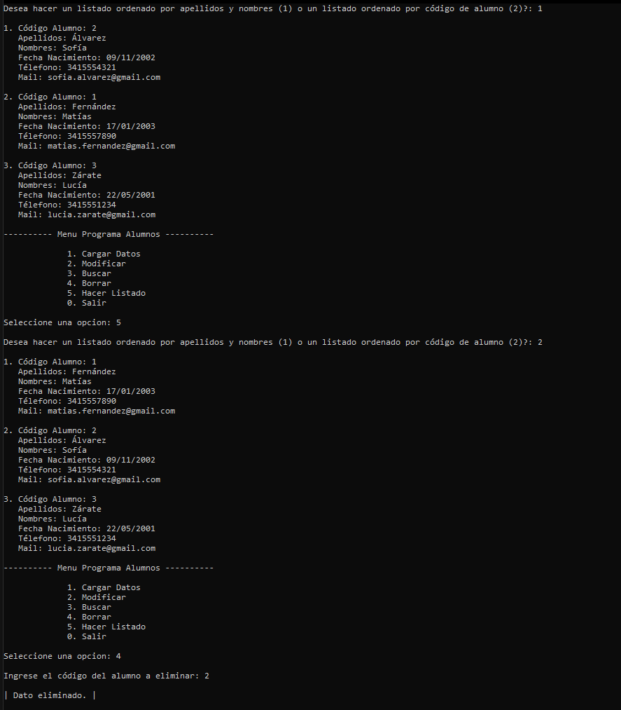
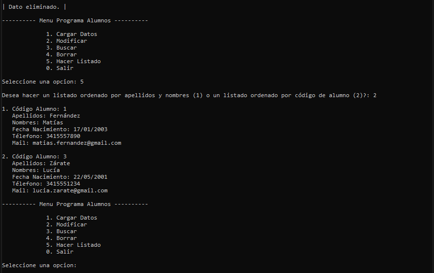

*[Leer en español](README.md)*

# File Handling Exercise

A C# console application that manages a student registry persisted in a plain
text file, with no database. It supports adding, searching, updating, and
deleting students, and generates listings sorted by two different criteria:
last name and first name, or student code.

Each student is stored as a line in the file with fields separated by `|`, and
parsed back when read. User input is validated field by field before writing,
and update and delete operations identify the student by their code so no
other records are affected.

## Screenshots

**Loading students**

**Sorted listings and deletion**

**Listing after deleting a student**

## Prerequisites

To open and run this project in your local environment, you need the following installed:

* .NET 8 SDK
* Visual Studio 2022

## How to run the project

1. Clone or download this repository to your computer.
2. Open the `Ejercicio con Archivos.sln` file in Visual Studio.
3. Press **Start** (or F5) to build and run the application.

The `ListaAlumnos.txt` file is created automatically the first time a student
is added.

---

## Author

**Leonel Maximiliano Blumberg**
Software Developer | .NET · C# · ASP.NET · SQL | Systems Engineering Student

[LinkedIn](https://www.linkedin.com/in/leonel-blumberg) · [GitHub](https://github.com/Leonel-Blumberg) · [Email](mailto:leonelblumberg.it@gmail.com)