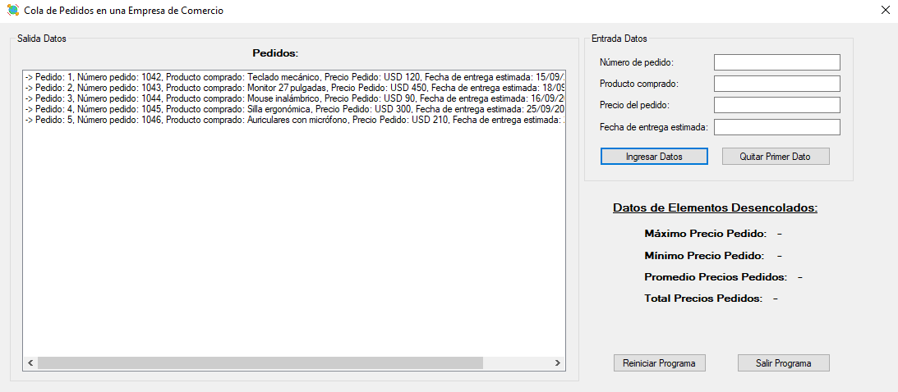
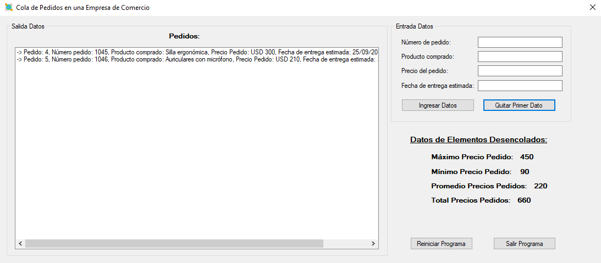

*[Leer en español](README.md)*

# Queues Practice

A C# desktop application built with Windows Forms that manages a queue of
orders. Both the queue and the node are implemented by hand, without using the
standard library collections, and the traversal that displays the contents is
solved with recursive methods.

Orders are served in the order they come in, which is what defines a queue. Each
one carries its number, the product purchased, the price, and the estimated
delivery date.

As orders get dispatched, the application computes the maximum, minimum,
average, and running total price over the ones already served.

## Screenshots

**Five orders queued up, none dispatched yet**

**After dispatching the first three, with the statistics computed**

## Prerequisites

To open and run this project in your local environment, you need the following installed:

* .NET Framework 4.8
* Visual Studio 2022

## How to run the project

1. Clone or download this repository to your computer.
2. Open the `Practica de Colas.sln` file in Visual Studio.
3. Press **Start** (or F5) to build and run the application.

---

## Author

**Leonel Maximiliano Blumberg** 
Software Developer | .NET · C# · ASP.NET · SQL | Systems Engineering Student

[LinkedIn](https://www.linkedin.com/in/leonel-blumberg) · [GitHub](https://github.com/Leonel-Blumberg) · [Email](mailto:leonelblumberg.it@gmail.com)
