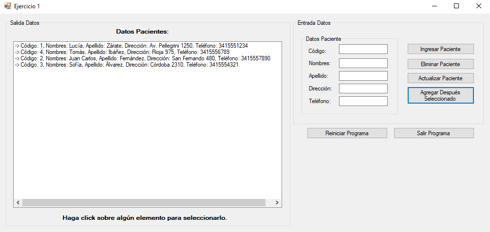
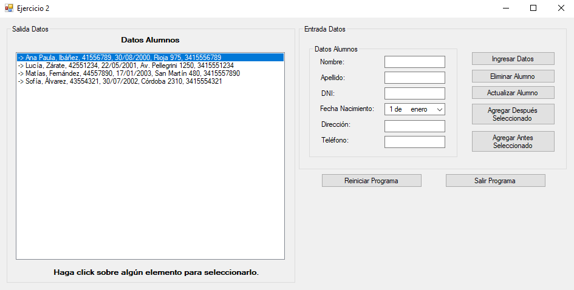
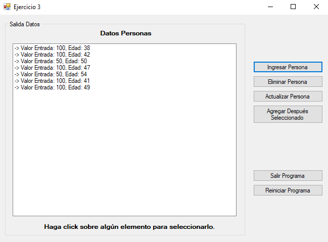

*[Leer en español](README.md)*

# Nodes Practice

Three singly linked list exercises in C# with Windows Forms. Both the list and
the node are implemented by hand, without using the standard library
collections, and traversal is solved with recursive methods.

Each exercise is a standalone project inside the same solution.

## Exercises

**Exercise 1.** A list of patients identified by code, with first names, last
name, address, and phone number. It supports appending, deleting, updating, and
inserting a patient right after the selected one.

**Exercise 2.** A list of students identified by their ID number, with first
name, last name, date of birth, address, and phone number. On top of the
previous exercise it adds inserting before the selected student, which is the
case that forces you to handle the head of the list.

**Exercise 3.** A list of people entering an event with a maximum capacity. Age
is drawn at random and the ticket price follows from it, with a reduced fare for
people under 18 and for those aged 50 or over. Once capacity is reached the
program blocks the operations.

## Screenshots

**Exercise 1, inserting after the selected patient**

**Exercise 2, inserting before the first student in the list**

**Exercise 3, ticket price based on age**

## Prerequisites

To open and run this project in your local environment, you need the following installed:

* .NET Framework 4.8
* Visual Studio 2022

## How to run the project

1. Clone or download this repository to your computer.
2. Open the `Practica de Nodos.sln` file in Visual Studio.
3. Set the exercise you want to try as the startup project and press **Start** (or F5) to build and run the application.

---

## Author

**Leonel Maximiliano Blumberg** 
Software Developer | .NET · C# · ASP.NET · SQL | Systems Engineering Student

[LinkedIn](https://www.linkedin.com/in/leonel-blumberg) · [GitHub](https://github.com/Leonel-Blumberg) · [Email](mailto:leonelblumberg.it@gmail.com)
