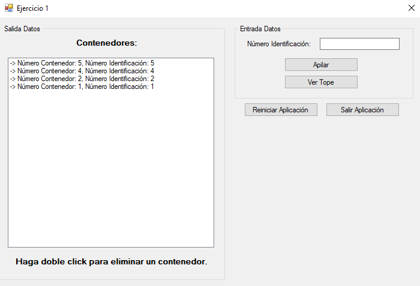
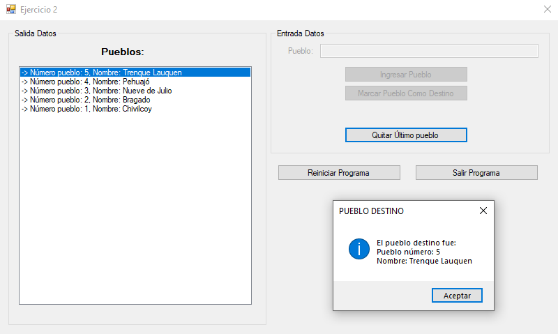
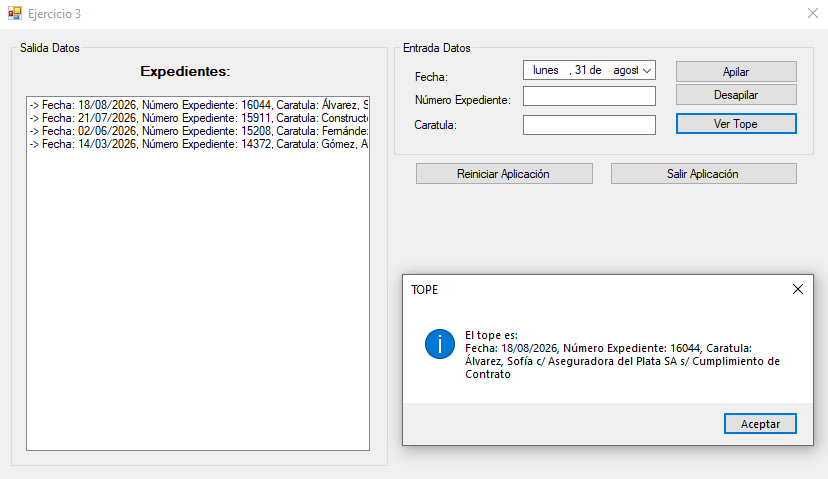

*[Leer en español](README.md)*

# Stacks Practice

Three stack exercises in C# with Windows Forms. Both the stack and the node are
implemented by hand, without using the standard library collections, and the
traversal that displays the contents is solved with recursive methods.

Each exercise is a standalone project inside the same solution.

## Exercises

**Exercise 1.** Containers stacked in a yard, each one with its identification
number. It supports pushing, peeking at the top, and pulling out a container
stuck in the middle. Since a stack only gives access to the top, the ones above
have to be unloaded onto an auxiliary stack, the target removed, and the rest
put back in their original order.

**Exercise 2.** A route through towns, where the last one pushed is the
destination. It supports pushing towns, marking the destination, and undoing the
last leg.

**Exercise 3.** Case files with a date, a number, and a title. It has the three
basic stack operations: push, pop, and peek.

## Screenshots

**Exercise 1, a container pulled out of the middle of the stack**

**Exercise 2, the last town pushed marked as the destination**

**Exercise 3, peeking at the case file on top of the stack**

## Prerequisites

To open and run this project in your local environment, you need the following installed:

* .NET Framework 4.8
* Visual Studio 2022

## How to run the project

1. Clone or download this repository to your computer.
2. Open the `Practica de Pilas.sln` file in Visual Studio.
3. Set the exercise you want to try as the startup project and press **Start** (or F5) to build and run the application.

---

## Author

**Leonel Maximiliano Blumberg** 
Software Developer | .NET · C# · ASP.NET · SQL | Systems Engineering Student

[LinkedIn](https://www.linkedin.com/in/leonel-blumberg) · [GitHub](https://github.com/Leonel-Blumberg) · [Email](mailto:leonelblumberg.it@gmail.com)
